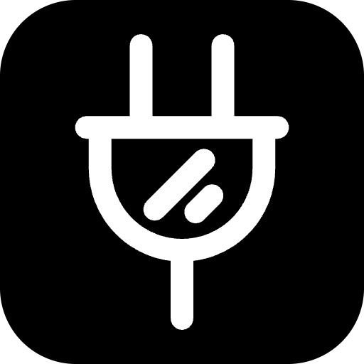

<p align="center">
  
</p>

<h1 align="center">mcpcn</h1>

<p align="center">
  Free and open-source, ready-to-use compound React components for MCP Apps.<br/>
  Composition first. One-command installation. Built with <a href="https://base-ui.com/">Base UI</a> and compatible with <a href="https://ui.shadcn.com/">shadcn/ui</a>.
</p>

<p align="center">
  <a href="https://github.com/shadcn-labs/mcpcn"></a>
  <a href="https://github.com/shadcn-labs/mcpcn/actions"></a>
  <a href="https://discord.gg/N6G36KhYK4"></a>
  <a href="https://x.com/shadcnlabs"></a>
</p>

<p align="center">
  <a href="https://mcpcn.dev/docs">Get Started</a> ·
  <a href="https://mcpcn.dev/docs/installation">Installation</a> ·
  <a href="https://mcpcn.dev/docs/blocks">Components</a>
</p>

## Features

- 🧩 **Composition first** — Extend and rearrange component content with ordinary JSX
- 🤖 **Built for MCP Apps** — Polished interface patterns for model-driven applications
- 📦 **shadcn/ui compatible** — Install source code with the familiar registry CLI
- ♿ **Base UI primitives** — Accessible foundations without Radix UI
- 🧱 **30 ready-to-use blocks** — Forms, payments, lists, messaging, social, maps, events, and more
- 🎨 **Theme aware** — Responsive components built with semantic color tokens
- 🔌 **OpenUI ready** — Every component page includes OpenUI integration guidance
- 🔓 **Open code** — Components are copied into your project for complete ownership

Install a component with one command:

```bash
npx shadcn@latest add https://mcpcn.dev/r/order-confirm.json
```

## Contributing

Contributions are welcome! Please feel free to submit a Pull Request.

1. Fork the repository
2. Create your feature branch (`git checkout -b feature/amazing-feature`)
3. Install dependencies (`pnpm install`)
4. Run the checks (`pnpm check && pnpm typecheck`)
5. Commit your changes (`git commit -m 'Add some amazing feature'`)
6. Push to the branch (`git push origin feature/amazing-feature`)
7. Open a Pull Request

## License

[MIT](LICENSE)

## Star History

<a href="https://www.star-history.com/?repos=shadcn-labs%2Fmcpcn&type=date&legend=top-left">
 <picture>
   <source media="(prefers-color-scheme: dark)" srcset="https://api.star-history.com/chart?repos=shadcn-labs/mcpcn&type=date&theme=dark&legend=top-left" />
   <source media="(prefers-color-scheme: light)" srcset="https://api.star-history.com/chart?repos=shadcn-labs/mcpcn&type=date&legend=top-left" />
   
 </picture>
</a>
