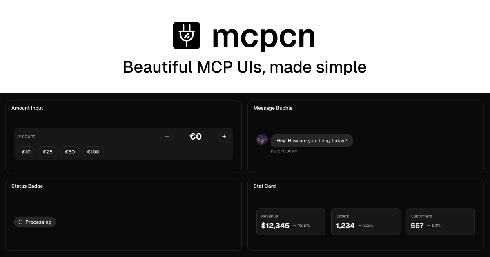

  

<h1 align="center">mcpcn</h1>

  Free & open-source, ready-to-use, customizable React components for MCP Apps. 
  Zero config. One command setup. Built with <a href="https://base-ui.com/">Base UI</a> and works seamlessly with <a href="https://ui.shadcn.com/">shadcn/ui</a>.

  
  
  
  

  <a href="https://mcpcn.dev/docs">Get Started</a> ·
  <a href="https://mcpcn.dev/docs/installation">Installation</a> ·
  <a href="https://mcpcn.dev/docs/blocks">Components</a>

## Features

- 🎨 **Theme-aware** — Adapts to existing light and dark themes with semantic color tokens
- 🎯 **Zero config** — Works out of the box with sensible defaults
- 📦 **shadcn/ui compatible** — Uses the same registry format and CLI
- ♿ **Base UI powered** — Accessible primitives without Radix UI
- 🧩 **Composable** — Import child components directly and arrange them with ordinary JSX
- 🤖 **Built for MCP Apps** — Forms, payments, messages, social content, maps, events, and more
- 🔌 **OpenUI ready** — Component documentation includes OpenUI integration guidance

## Contributing

Contributions are welcome! Please feel free to submit a Pull Request.

1. Fork the repository
2. Create your feature branch (`git checkout -b feature/amazing-feature`)
3. Install dependencies (`pnpm install`)
4. Run the checks (`pnpm fix && pnpm typecheck`)
5. Commit your changes (`git commit -m 'Add some amazing feature'`)
6. Push to the branch (`git push origin feature/amazing-feature`)
7. Open a Pull Request

## License

[MIT](LICENSE)

## Star History

<a href="https://www.star-history.com/?repos=shadcn-labs%2Fmcpcn&type=date&legend=top-left">
 <picture>
   <source media="(prefers-color-scheme: dark)" srcset="https://api.star-history.com/chart?repos=shadcn-labs/mcpcn&type=date&theme=dark&legend=top-left" />
   <source media="(prefers-color-scheme: light)" srcset="https://api.star-history.com/chart?repos=shadcn-labs/mcpcn&type=date&legend=top-left" />
   
 </picture>
</a>
